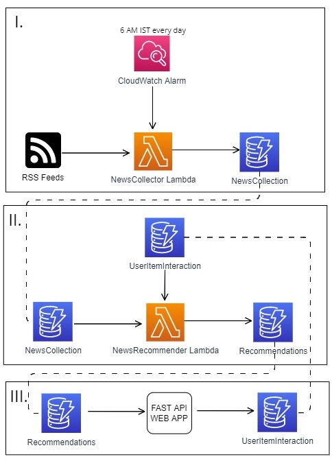
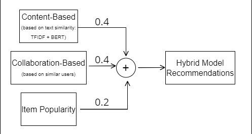

# Newsify

A News Aggregator and Recommendation System.

## Technologies Used

* [Pandas](https://pandas.pydata.org/) : is a fast, powerful, flexible and easy to use open source data analysis and manipulation tool,
built on top of the Python programming language.
* [FAST API](https://fastapi.tiangolo.com/) : is a modern, fast (high-performance), web framework for building APIs with Python 3.6+ based on standard Python type hints.
* [AWS](https://aws.amazon.com/) : Amazon Web Services offers reliable, scalable, and inexpensive cloud computing services. Free to join, pay only for what you use.
* [RSS](https://en.wikipedia.org/wiki/RSS) : is a web feed that allows users and applications to access updates to websites in a standardized, computer-readable format.

## Architecture Diagram

## Components Elaboraton:

1. ### NewsCollector
   * AWS CloudWatch is used to trigger the NewsCollector Lambda function based on alarm set for a specific time for every day.
   * RSS Feeds from various news site, including NY Times, Times Of India, BBC news, The Hindu, etc. are read by the Lambda function.
   * NewsCollector Lambda Function is a python script that reads the feeds and stores them in a dynamoDB with a key for each entry.
   * NewsCollection is a DynamoDb table which stores the News Feeds.  

2. ### NewsRecommender
   * NewsRecommender Lambda function generates Recommendations for users using the user-item-interactions and the news feeds based on [this](#recommendation-system).
   * Recommendations is a dynamoDb table which stores the recommendations for each user and a default one.

3. ### MyNewsApi
   * A fastApi based web app which shows recommendations for a user and also updates the user-item-interactions. 
   * UserItemInterations is a dynamoDb table to store the user-item-interaction.

## Recommendation System:

