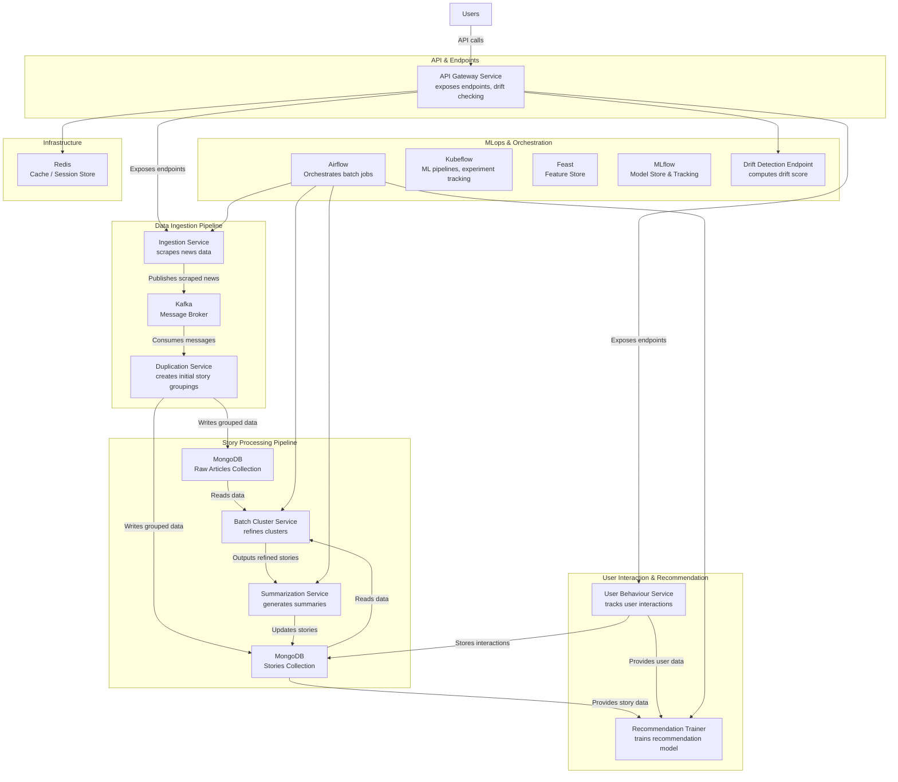
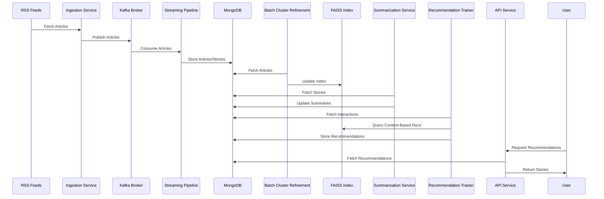

# News Recommendation Pipeline

### Overview
The News Recommendation Pipeline is a comprehensive MLOps-driven system designed to ingest news articles from RSS feeds, process and cluster them into stories, generate summaries, and provide personalized recommendations to users. Built with scalability and maintainability in mind, it leverages a Kubernetes-based deployment on a single EC2 instance using Minikube, integrating modern tools like Kafka, Redis, MongoDB, Airflow, and Kubeflow to create a robust end-to-end pipeline. The system includes advanced features such as model drift detection, automatic retraining, and bias monitoring, ensuring high-quality recommendations that adapt to changing user behavior and content trends.

## Key Features
- Real-Time Ingestion: Scrapes articles from RSS feeds and streams them via Kafka.
- Story Clustering: Groups articles into coherent stories using UMAP and HDBSCAN.
- Summarization: Generates concise summaries for stories using a lightweight transformer model (DistilBART).
- Personalized Recommendations: Combines collaborative filtering (ALS) and content-based methods (FAISS) for hybrid recommendations.
- Model Drift Detection: Monitors recommendation performance and triggers retraining when drift exceeds a threshold.
- MLOps Integration: Uses Airflow for orchestration, Kubeflow for pipeline management, and a feature store in MongoDB.
- API Gateway: Exposes RESTful endpoints for recommendations and story retrieval.
- Bias Detection: Monitors recommendation diversity and sentiment to ensure fairness.

## Project Architecture
### High-Level Architecture

The pipeline consists of several microservices interacting through Kubernetes DNS-based service discovery, with data flowing through Kafka, Redis, and MongoDB for processing and storage.



### Component Descriptions
- **Ingestion Service**: Scrapes news data from various sources and publishes the results to Kafka for downstream processing.

- Kafka (Message Broker): Serves as the communication backbone by asynchronously relaying news data from the Ingestion Service to the Streaming Pipeline.

- Streaming Pipeline (Duplication Service): Processes articles from Kafka, extracts features (embeddings, entities), and clusters them into stories in MongoDB.

- MongoDB: Acts as the primary datastore with separate collections for raw news articles and processed story data.

- Batch Cluster Refinement: Periodically reads grouped data from MongoDB, refines story clusters and updates the FAISS index for content-based recommendations.

- Summarization Service: Generates concise summaries for the refined story clusters using DistilBART and updates the corresponding records in MongoDB.

- User Behaviour Service: Tracks user interactions (such as clicks and views) and stores this behavioral data in MongoDB for further analysis.

- Recommendation Trainer: Periodically trains the recommendation model using both story data and user interaction data an ALS model, computes user embeddings, and precomputes hybrid recommendations, stored in MongoDB, typically orchestrated as a batch job via Airflow.

- API Gateway Service: Exposes HTTP endpoints for both external users and internal services (including model drift checking) and acts as the single entry point for API calls.

- Drift Detection Endpoint: Computes the model drift score, which is used to determine if the recommendation model needs to be retrained.

- Airflow: Orchestrates all batch jobs (ingestion, clustering, summarization, and training) through scheduled DAGs, ensuring smooth workflow execution.

- Kubeflow: Integrates with the ML pipeline for experiment tracking, model deployment, and overall ML workflow management.

- Feast (Feature Store): Centralizes feature management for machine learning, ensuring consistent access to features during both training and serving.

- MLflow (Model Store & Tracking): Provides model versioning, experiment tracking, and storage capabilities to support reproducible ML workflows.

- Redis: Functions as a caching layer, enhancing performance for the API Gateway and other components that require quick data access.

- Users: External clients that interact with the system via the UI, consuming news, summaries, and personalized recommendations.

### Data Flow



## Setup
### Prerequisites
- AWS Account: For EC2 instance provisioning.
- Terraform: To deploy the EC2 instance.
- Minikube: For local Kubernetes cluster on EC2.
- Docker: For containerizing services.
- Python 3.9+: For running services locally.
- Dependencies: Listed in requirements.txt.


### 1. Provision Infrastructure
Initialize Terraform:
```bash
cd terraform
terraform init
terraform apply -auto-approve
```

SSH into EC2:
```bash
ssh -i your-key.pem ec2-user@<instance_public_ip>
```
### 2. Start Minikube
```bash
minikube start --driver=docker --memory=12000 --cpus=4
minikube addons enable ingress
minikube addons enable metrics-server
```

### 3. Deploy Dependencies
MongoDB:
```bash
kubectl apply -f k8s/mongo-deployment.yaml
```

Kafka:
```bash
kubectl apply -f k8s/kafka-deployment.yaml
```

Redis:
```bash
kubectl apply -f k8s/redis-deployment.yaml
```

PostgreSQL (for bias detection):
```bash
kubectl apply -f k8s/postgres-deployment.yaml
```

### 4. Build and Deploy Services
For each service:

Build Docker Image:
```bash
docker build -t your-registry/<service>:latest -f <service>.Dockerfile .
docker push your-registry/<service>:latest
```

Deploy to Kubernetes:
```bash
kubectl apply -f k8s/<service>-deployment.yaml
```

### 5. Configure Orchestration
Airflow:
```bash
helm install airflow apache-airflow/airflow --set executor=KubernetesExecutor
kubectl cp dags/recommendation_trainer_dag.py airflow-pod:/opt/airflow/dags/
```

Kubeflow:
```bash
curl -s "https://raw.githubusercontent.com/kubeflow/manifests/v1.8.0-rc.1/install.sh" | bash
```